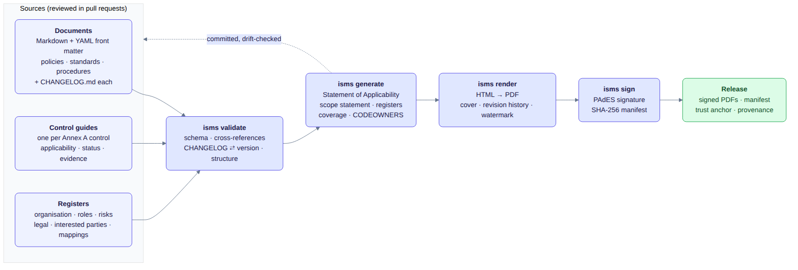
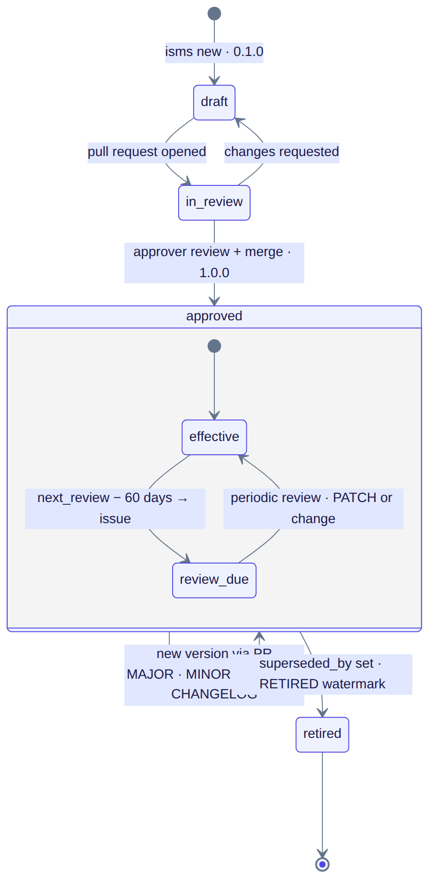
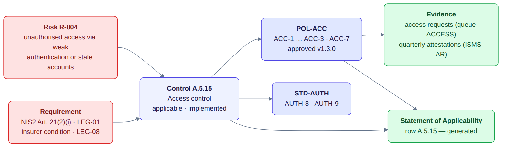
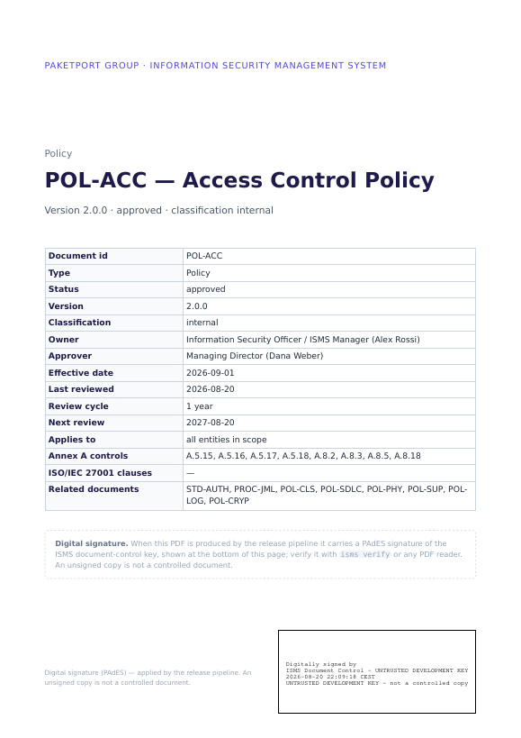
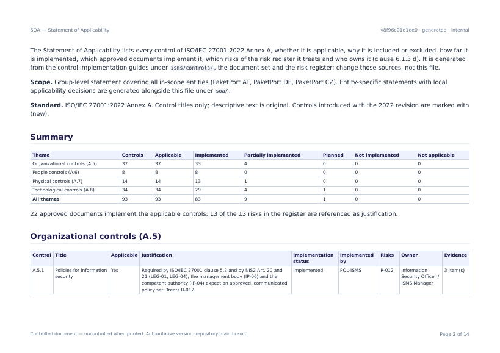
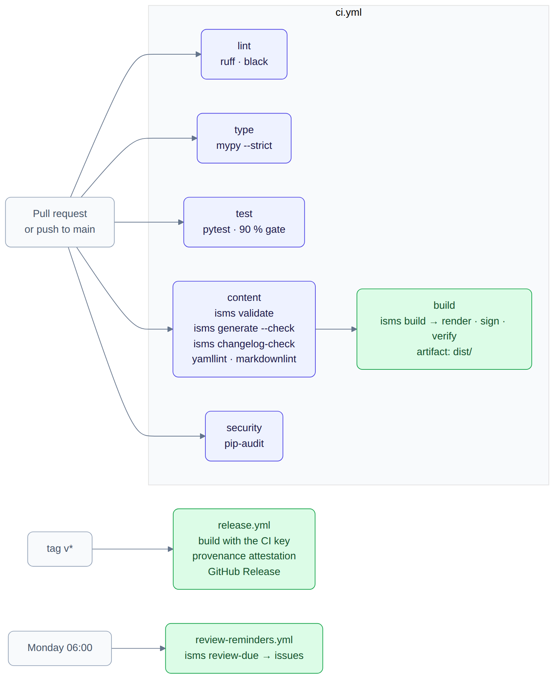

# isms-as-code

> **ISMS-as-code.** An ISO/IEC 27001:2022 policy and control repository run with the discipline of
> a software project: policies, standards and procedures as Markdown with validated front matter,
> reviewed and approved through pull requests, a Statement of Applicability and an ISMS scope
> statement **generated** from the same files, and PAdES-signed PDFs built by CI.

[](https://github.com/jjsanda/isms-as-code/actions/workflows/ci.yml)
[](https://github.com/jjsanda/isms-as-code/actions/workflows/codeql.yml)


[](LICENSE)
[](LICENSE-docs)

---

## What is this? (in one picture)

The complete document set of an information security management system for the *fictional*
**PaketPort group** — an operator of street-sited parcel lockers with a cloud backend, a German
sales-and-service subsidiary and a Czech development centre, a NIS2 essential entity. Every
policy is a Markdown file with metadata; every Annex A control has an implementation guide; the
organisation, roles, risks and legal obligations are YAML registers. A small Python tool
validates the whole set, generates the derived artefacts, renders and signs the PDFs.



*The sources are reviewed in pull requests. `isms validate` refuses inconsistency (a policy that
cites a control that does not exist, a CHANGELOG that disagrees with the version, a retired
document whose successor does not name it). `isms generate` turns the sources into the Statement
of Applicability, the scope statement, the registers, the coverage reports and even the
`CODEOWNERS` file — deterministically, so CI can prove the committed copies are current.
`isms build` renders every document to a PDF with cover, revision history and watermark, signs
it, and writes the manifest.*

The ISMS is written for one group with three legal entities, which is where most of the
interesting decisions live: documents carry `applies_to`, control guides carry per-entity
overrides, and the SoA is generated per entity as well as for the group.

## Why it's built this way

| Area | Choice | Why it matters for an ISMS |
| --- | --- | --- |
| **Document format** | Markdown + YAML front matter, one folder per document with its own `CHANGELOG.md` | Line-by-line review, metadata the tooling can validate, GitHub renders it without a build ([ADR&nbsp;0001](docs/adr/0001-markdown-front-matter-documents.md)) |
| **Versioning** | SemVer per document; the newest CHANGELOG entry *is* the version and the approval date | MAJOR means new obligations and triggers communication; PATCH records a periodic review; a PR without a bump fails CI ([ADR&nbsp;0002](docs/adr/0002-semver-and-changelog-per-document.md)) |
| **Derived artefacts** | SoA, scope statement, registers, coverage, CODEOWNERS are generated, committed and drift-checked | The SoA can never disagree with the control guides; reviewers see the SoA diff in the PR ([ADR&nbsp;0003](docs/adr/0003-committed-generated-artefacts-with-drift-check.md)) |
| **Signed PDFs** | PAdES signature in every PDF, two-tier document-control key from CI secrets, ephemeral *untrusted* key otherwise | Readers see a signature their PDF viewer understands; a dev build can never pass as a controlled copy ([ADR&nbsp;0004](docs/adr/0004-pades-signing-with-pyhanko.md)) |
| **Ownership** | Roles, never people; review routing generated from ownership metadata | A.5.2 by construction; a change of holder touches no document ([ADR&nbsp;0005](docs/adr/0005-role-based-ownership-generated-codeowners.md)) |
| **Standards** | ISO/IEC 27001:2022 Annex A, NIS2 Directive (EU) 2022/2555, GDPR, Cyber Resilience Act | Controls, risks, legal items and documents trace to real clauses and articles — only control titles are taken from the standard; all text is original |
| **Engineering** | Pydantic `extra="forbid"`, `mypy --strict`, ruff, 90 % coverage gate, offline and deterministic | The compliance content is backed by production-grade software craft |

## What's in the repository

| | Count | Where |
| --- | --- | --- |
| Policies | 18 (16 approved, 1 in review, 1 retired) | `isms/policies/` |
| Standards | 2 | `isms/standards/` |
| Procedures | 7 (6 approved, 1 draft) | `isms/procedures/` |
| Annex A control implementation guides | 93 — all applicable at group level, 8 excluded at the German entity | `isms/controls/` |
| Risks | 13 on a 5×5 scale, every one cited by the controls that treat it | `isms/risk/` |
| Entities · sites · services | 3 in scope (+ 1 excluded with justification) · 8 · 8 | `isms/context/organisation.yaml` |
| Roles | 13, with holders, deputies and review handles | `isms/context/roles.yaml` |
| Interested parties · legal items | 10 · 8 (NIS2, GDPR, CRA, ISO/IEC 27001, carrier and cloud contracts, insurer, labour law) | `isms/context/` |
| Requirement mappings | NIS2 Art. 20/21(2)/23 (12 areas) · ISO/IEC 27001 clauses 4–10 (25 clauses) | `isms/mappings/` |
| Generated artefacts | SoA (group + 3 entities, Markdown + CSV), scope statement, document register, risk register, 2 coverage reports, CODEOWNERS, badges | `generated/`, `.github/CODEOWNERS` |

Every document states purpose, scope, numbered **policy statements with stable ids** (`ACC-8`,
`LOG-4` …) that other documents and the control guides cite, roles and responsibilities, and the
compliance and exception path. PROC-DOC — the document control procedure — describes exactly the
workflow this repository implements, which makes it the first document an auditor reads.

## The document life cycle



`isms new policy --id POL-XYZ …` scaffolds a draft; the pull request is reviewed by the owner
role and the approver role (generated `CODEOWNERS`); the merge is the approval record. Every later
change is a new version with a CHANGELOG entry — `isms changelog-check` blocks a PR that forgets.
Sixty days before `next_review` a scheduled job opens an issue; a review without changes is a
PATCH version. Retirement sets `superseded_by`, and the validator insists the successor names the
retired document too. POL-ACC's CHANGELOG shows five versions, the newest a MAJOR change merged from a reviewed branch, and POL-EMAIL is a retired document
whose rules moved into POL-AUP.

## From risk to evidence



The SoA justification of a control is not a sentence somebody typed into a spreadsheet: it cites
risk ids, legal-register items and interested-party requirements that exist as data, and the
validator checks every one of them. A risk treated by "modify" must name applicable controls; a
control cannot be marked not applicable while a risk relies on it; a retained risk must be
accepted by the role the criteria allow for its band. Open
[`generated/statement-of-applicability.md`](generated/statement-of-applicability.md) and follow
any row to its guide, from the guide to the statements, from the statements to the CHANGELOG.

## One ISMS, three entities


The scope statement, the per-entity SoAs and the legal register are generated from
`organisation.yaml`, so adding an entity is a data change, not a copy of the document set.
PaketPort Deutschland GmbH performs no development, so the development controls are
not applicable *there* with an entity-specific justification — and nowhere else.
See [docs/multi-entity.md](docs/multi-entity.md).

## What the pipeline produces

| Cover page of a signed policy | Statement of Applicability |
| --- | --- |
| [](docs/samples/) | [](docs/samples/) |

`docs/samples/` holds a few signed PDFs from a local build together with `SHA256SUMS` and the
trust anchor. They are signed with the **ephemeral development key** — the stamp and the signer
name say so — because this repository's CI has no production key configured. Verify them with
`uv run isms verify --out docs/samples` or by importing the trust anchor into a PDF viewer.

## Quickstart

```bash
make setup          # uv sync --dev --extra pdf, pre-commit hooks
make validate       # schema, cross-references, structure, CHANGELOG ⇄ version
make generate       # regenerate generated/ and .github/CODEOWNERS (deterministic)
make build          # validate → generate → render → sign → manifest → verify  (dist/, ~30 s)
make review-due     # what is due within 60 days
uv run isms soa --entity ENT-DE | less
ISMS_NOW=2027-09-01 uv run isms review-due --format md
```

Requires Python 3.12 and [`uv`](https://docs.astral.sh/uv/); PDF rendering needs pango/harfbuzz
(preinstalled on most desktops and on GitHub runners).

## The `isms` command

| Command | What it does |
| --- | --- |
| `isms validate [--strict]` | Loads everything, reports every schema and cross-reference problem at once; warnings for overdue reviews and drafts |
| `isms generate [--check]` | Writes (or verifies) the SoA, per-entity SoAs, scope statement, document and risk registers, coverage reports, CODEOWNERS and badge JSON |
| `isms soa [--entity ID] [--format md\|csv]`, `isms scope`, `isms register` | The same artefacts on standard output |
| `isms review-due [--within N] [--format table\|md\|json]` | Documents and control assessments due or overdue as of today (`ISMS_NOW` to pin a date) |
| `isms changelog-check --base REF` | Fails if a document changed since REF without a CHANGELOG entry and a version bump |
| `isms new {policy,standard,procedure} --id … --title … --owner … --approver …` | Scaffolds a draft from the templates |
| `isms render [--only ID …] [--html-only]` | Markdown → HTML → PDF with cover, revision history, watermark, running headers |
| `isms sign`, `isms verify [--trust PEM]`, `isms build` | PAdES signing with the CI key or an ephemeral dev key; verification of signatures and manifest; the whole chain |
| `isms keygen --passphrase …` | Creates a real document-control key (PKCS#12) and its public trust anchor for deployment |

## Governance in practice



- **`ci.yml`** — lint, types, tests (90 % gate), content (`validate`, `generate --check`,
  `changelog-check` on PRs, yamllint, markdownlint), a full signed build uploaded as an artifact,
  `pip-audit`.
- **`release.yml`** — on a `v*` tag: build with the configured key, attest provenance, publish the
  PDFs, `SHA256SUMS` and the trust anchor as release assets.
- **`review-reminders.yml`** — every Monday, one issue per due review, idempotent.
- **PR template and issue forms** — change request, exception request, document review.
- **`.github/CODEOWNERS`** — generated: owner role + approver role per document, control owner per guide.

## Project layout

```text
isms/                      # the ISMS — hand-authored, validated sources
  policies/ standards/ procedures/   # <ID>-<slug>/README.md + CHANGELOG.md
  controls/<theme>/A.x.y.md          # 93 control implementation guides
  catalogue/ context/ risk/ mappings/ templates/
generated/                 # GENERATED by `isms generate`, drift-checked in CI
src/isms_as_code/          # the tool: models, loader, validate, generate/, render/, signing, build, cli
tests/                     # unit, generate, render, signing, cli, content (the corpus audits itself)
docs/                      # authoring guide, auditor guide, multi-entity, architecture, glossary, ADRs,
                           #   diagrams (Mermaid sources + rendered), samples (signed PDFs), screenshots
.github/                   # workflows, generated CODEOWNERS, PR template, issue forms
```

## Where to find what

| If you are looking for… | …look at |
| --- | --- |
| **ISO/IEC 27001:2022 taxonomy** | the [catalogue](isms/catalogue/iso27001-2022-annex-a.yaml) with ISO/IEC 27002 attributes, the [SoA](generated/statement-of-applicability.md), the [clause coverage](generated/coverage-iso27001-clauses.md) |
| **Policy writing** | [POL-ACC](isms/policies/POL-ACC-access-control-policy/README.md), [POL-IR](isms/policies/POL-IR-information-security-incident-response-policy/README.md), [PROC-IR](isms/procedures/PROC-IR-incident-response-and-nis2-reporting-procedure/README.md) with the NIS2 reporting table, the [authoring guide](docs/authoring-guide.md) |
| **Documentation life cycle** | [PROC-DOC](isms/procedures/PROC-DOC-document-control-procedure/README.md), the [document register](generated/document-register.md), `isms review-due`, the CHANGELOG of POL-ACC |
| **Git-based governance** | the PR template, generated CODEOWNERS, `changelog-check`, the workflows, the merge history |
| **NIS2 and regulatory mapping** | the [NIS2 coverage report](generated/coverage-nis2-article-21.md), the [legal register](isms/context/legal-register.yaml), PROC-IR stage 6 |
| **Multi-entity operation** | the [scope statement](generated/isms-scope-statement.md), `generated/soa/ENT-DE.md`, [docs/multi-entity.md](docs/multi-entity.md) |
| **Audit and certification readiness** | the [auditor guide](docs/auditor-guide.md), PROC-AUDIT, PROC-MR, PROC-CAPA, the evidence lists in every control guide |
| **Software craft** | `src/isms_as_code/`, `mypy --strict`, deterministic generators, PAdES signing, the test suite |

## Testing & quality

- `make test` runs fully offline (no network, no secrets). `make ci` adds formatting, lint, types,
  security, validation and the generation drift check.
- **Coverage gate 90 %.** The corpus is tested as content: every document validates, statement ids
  are unique and sequential, "Related documents" sections match the front matter, documents name
  roles and never people, every risk is cited by a control, generated artefacts are in sync.
- **Determinism is a test:** generating twice yields identical bytes; rendering twice yields
  identical unsigned PDFs.
- **Signing is a test:** sign, verify against the trust anchor, reject a foreign anchor, detect a
  tampered file and a broken manifest.

## Tradeoffs & what's next

- **Illustrative, not operated** — the evidence locations and implementation statuses describe
  how the fictional group works; the mechanism (validation, versioning, review, generation,
  signing) is real. The auditor guide says so plainly.
- **Self-managed trust** — the document-control key is an internal PKI; readers import the trust
  anchor. A timestamp-authority countersignature (`--tsa-url`) and a qualified certificate would
  be the production step.
- **Attributes to verify** — the ISO/IEC 27002 attribute values in the catalogue are reference
  metadata and should be checked against the purchased standard before being relied on.
- **Next** — evidence collection hooks that turn the `evidence` entries into automated checks,
  and a control-maturity dimension in the SoA.

## License

[Apache-2.0](LICENSE) for the tooling, [CC BY 4.0](LICENSE-docs) for the documents under `isms/` ·
© 2026 Josef Šanda. This is a portfolio project; **the PaketPort group is fictional** and no
content is confidential (see [NOTICE](NOTICE)).
