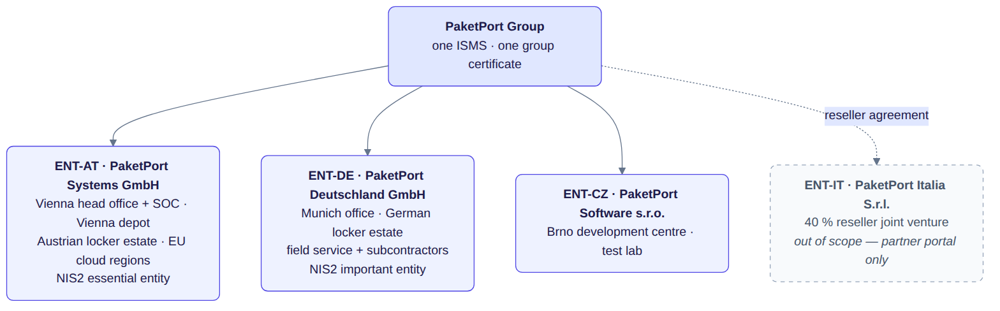

# One ISMS, several entities

PaketPort runs one management system across three legal entities in three countries. The
repository models that explicitly instead of copying the document set per subsidiary.

## How entities appear in the data

- **`isms/context/organisation.yaml`** lists every entity (`ENT-AT`, `ENT-DE`, `ENT-CZ`, and the
  out-of-scope `ENT-IT` with its justification), every site with its kind and functions, the
  services and which entities deliver them, the information systems and where they are hosted,
  and the interfaces to outside parties. The scope statement is generated from it.
- **Documents** carry `applies_to: [all]` by default. A document limited to one entity lists the
  entity ids; the validator rejects unknown or out-of-scope entities, and the scope statement lists
  documents with limited applicability.
- **Control guides** carry optional `entity_overrides`: a per-entity applicability decision with
  its own justification (for example, the development controls A.8.4 and A.8.25–A.8.33 are not
  applicable at PaketPort Deutschland GmbH, which performs no development). An override may also
  state a different implementation status.
- **Roles** include entity-level accountability (`country-manager-de`, `site-lead-cz`) so that
  procedures can name who does what locally (PROC-IR stage 6, PROC-JML stage 2.3).
- **The legal register** records which requirement applies to which entity and what must be
  verified per jurisdiction (national NIS2 transposition, labour-law limits on screening).

## What is generated per entity

`isms generate` writes a group SoA and one SoA per in-scope entity (`generated/soa/ENT-DE.md` …).
Entity SoAs inherit every group decision and apply the overrides; implementing documents are
listed only if they apply to that entity. `isms soa --entity ENT-DE` prints the same on demand.

## Adding an entity

1. Add the entity, its sites and its share of the services to `organisation.yaml`; add
   entity-level roles to `roles.yaml` if local accountability is needed.
2. Add the jurisdiction's requirements to the legal register (`applies_to: [ENT-XX]`).
3. Run the risk assessment for the entity (PROC-RISK stage 1.3) and record entity risks.
4. Review every control guide for `entity_overrides`; review documents for `applies_to`.
5. `make validate && make generate` — the scope statement, the entity SoA and CODEOWNERS follow.
6. Extend the audit programme (PROC-AUDIT stage 1) and the exercise plan (POL-IR IR-4).
